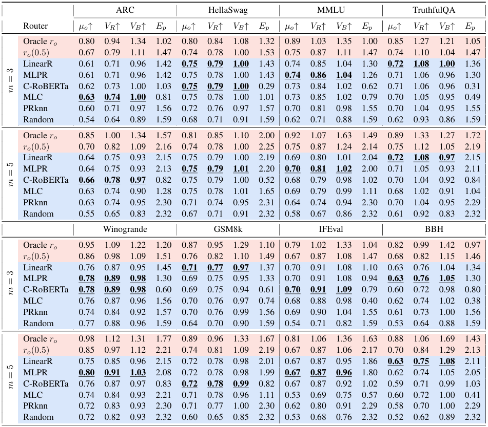
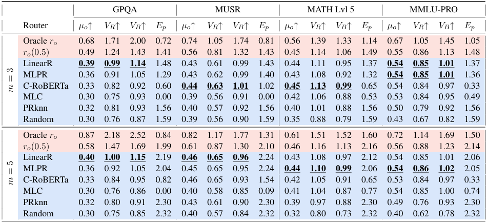

#  RouterEval: A Comprehensive Benchmark for Routing LLMs to Explore Model-level Scaling Up in LLMs

[]()
[]()

[](https://arxiv.org/abs/2503.10657)


This repository is the official codebase of our paper "RouterEval: A Comprehensive Benchmark for Routing LLMs to Explore Model-level Scaling Up in LLMs" [[paper]](https://arxiv.org/abs/2503.10657) [[slide]](https://github.com/MilkThink-Lab/RouterEval/blob/main/figure/slide.pdf).
The proposed RouterEval is a comprehensive benchmark for evaluating router performance in the Routing LLMs paradigm, featuring **12 LLM evaluations**, **8,500+ LLMs**, and **200,000,000+ data records**.


## 🎉 News
2025-10 - We released our raw data (including original answers) in  [[Hugging Face]](https://huggingface.co/datasets/linggm/RouterEval/tree/main/full_data). 👈🎉Please try it! 

2025-03 - We released our all dataset in [[Baidu Drive]](https://pan.baidu.com/s/1h2xeM2iEPJmdp9H-ZQpaMA?pwd=m1ce) [[Google Drive]](https://drive.google.com/drive/folders/1LnIk4zKQMjBKX7oFr1-FHUzpsmPISAIQ?usp=sharing) [[Hugging Face]](https://huggingface.co/datasets/linggm/RouterEval). 👈🎉Please try it! 

2025-03 - We released a curated list of awesome works in the Routing LLMs [[Link]](https://github.com/MilkThink-Lab/Awesome-Routing-LLMs). 👈🎉Please check it out! 


## ⚙️ Environment Setup
Create a Python virtual environment and install all the packages listed in the ```requirements.txt```.
```bash
conda create -n llmooo python=3.10
conda activate llmooo
pip install -r requirements.txt
```

## 📦 Data Download

**Data Download**: [[Baidu Drive]](https://pan.baidu.com/s/1h2xeM2iEPJmdp9H-ZQpaMA?pwd=m1ce) [[Google Drive]](https://drive.google.com/drive/folders/1LnIk4zKQMjBKX7oFr1-FHUzpsmPISAIQ?usp=sharing) [[Hugging Face]](https://huggingface.co/datasets/linggm/RouterEval)


The data format in the cloud drive is as follows.  You can just download the ```router_dataset``` for basic use.
```
data/
├── leaderboard_score/    # 200M score records across 8500 LLMs and 12 datasets
├── leaderboard_prompt/   # Full prompts for all test cases 
├── leaderboard_embed/    # Pre-computed embeddings (4 types)
└── router_dataset/       # ready-to-use router evaluation data (12 datasets)
```

Recommendation➡️ For direct use of our pre-built router datasets:

* Create a ```data``` folder and download ```router_dataset```  to the ```data``` folder
* For basic use, there is **NO NEED** to download ```leaderboard_score```, ```leaderboard_prompt```, and ```leaderboard_embed```.

```bash
# Create a 'data' directory in the root of this repository
mkdir data
cd data

# Download the dataset file (router_dataset.zip) to data/
# Download using the wgt command or manually download from the link above
ids="1BurZNXnHkva2umQxKbvhgccuKQ35p_Ki"
url="https://drive.google.com/uc?id=$ids&export=download"
wget --no-check-certificate "$url" -O router_dataset.zip
unzip router_dataset.zip
```

## 🚀 Quick Start
#### A minimal usage example
Run ```quick_start.ipynb``` to view the information of the router dataset, build a simple router, train and test the router using the data from the dataset, and check the performance metrics.


#### Experimental Settings
| Difficulty Level | Candidate Pool Size   | Candidate Groups                |
|------------------|-----------------------|--------------------------------------|
| Easy             | [3, 5]                | all strong / all weak / strong to weak                   |
| Hard             | [10, 100, 1000]       | all strong / all weak / strong to weak       |


## 🧪 Testing Baseline Routers
#### Baseline Implementations

```
router/
├── C-RoBERTa-cluster/    # C-RoBERTa router
├── MLPR_LinearR/         # mlp & linear router
├── PRKnn-knn/            # kNN router
├── R_o/                  # Oracle & r_o & random router
└── RoBERTa-MLC/          # MLC router
```

#### Train and test the router

In `test_router.py`, change `baseline = 'knn'` to one of `['knn', 'oracle', 'random', 'r_o_0.5', 'linear', 'mlp', 'roberta_cluster', 'roberta_MLC']`, then run
```
python test_router.py
```

## 🛠️ Testing Custom Routers
If you want to design a router and test its performance on the router datasets, you can follow the steps below.

1. Create new folder under ```router/```

2. Implement your method with required format:

```python
# train your router
......
# test your router
......
# compute metircs (Must print these three metrics at last)
......
print(mu, vb, ep)  
```

3.  Add command to run your router in ```test_router.py```.

4.  Run ```test_router.py``` to test your custom router.

## 🔧 Advanced Tutorial 1: Replacing the Embedding Model
Advanced Usage (**optional**) ➡️ For custom embeddings, you can:

* Download ```leaderboard_prompt```  and process with your embedding model.
* Download ```leaderboard_embed``` and use existing pre-computed embeddings  (including four embed models: longformer, RoBERTa, RoBERTa_last, and sentence_bert).

## 🔧 Advanced Tutorial 2: Constructing Router Dataset
Advanced Usage (**optional**) ➡️ To reproduce the construction process of the Router Dataset, you can: 

1. Download ```leaderboard_score```, ```leaderboard_prompt```, and ```leaderboard_embed```

2. Place the three folder in ```data/``` directory

3. Run ```get_router_dataset.py``` to build router datasets:

```base
python get_router_dataset.py
```


## 📊 Baseline Results 





